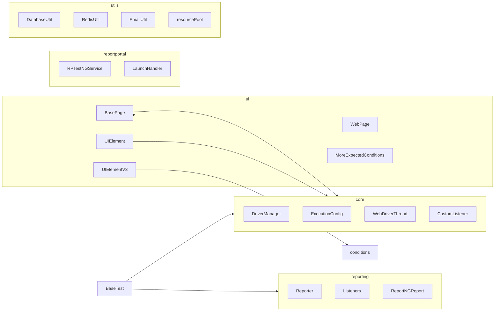

# Autumn Codebase – Complete Context

## 1. Project identity

- **Name:** Autumn (README: "auto_fw")
- **Path:** autumn (this repo)
- **Type:** Maven multi-module parent; the `autumn` submodule is the main JAR (automation framework library).
- **Group/Artifact:** `com.paytm.autumn` / `parent-automation` (parent), `autumn` (module).
- **Version:** 3.2.11-SNAPSHOT
- **Java:** 11
- **Branch (from git):** selenium4

Parent POM profiles:

- **BUILDING** (default): builds only `autumn`.
- **DEPLOYMENT**: `autumn` + `../payment-automation-util`.
- **ALL**: `autumn` + `../payment-automation-util` + `../pgp_automation`.

---

## 2. Tech stack (from [pom.xml](pom.xml) and [autumn/pom.xml](autumn/pom.xml))

| Area               | Technology                                                                                      |
| ------------------ | ----------------------------------------------------------------------------------------------- |
| Browser automation | Selenium 4.12.1 (netty 4.1.96.Final overrides)                                                  |
| Test runner        | TestNG 7.7.0                                                                                    |
| Driver management  | WebDriverManager (Bonigarcia) 5.5.3                                                             |
| Reporting          | Allure 2.22.1, ReportNG, ExtentReports (provided), Report Portal (epam agent-java-testng 5.0.7) |
| Assertions         | Fest Assert, AssertJ                                                                            |
| API / JSON         | Rest Assured 3.0.2, json-simple, Jackson (core, databind, YAML)                                 |
| DB / caches        | MySQL connector, Jedis, Lettuce (Redis), Elasticsearch transport, Aerospike                     |
| Other              | OpenCSV, JXL, FF4J, gRPC/protobuf, JSch, AShot (screenshots), Awaitility                        |

---

## 3. Package layout and responsibilities

All framework code lives under `com.paytm.framework` in [autumn/src/main/java/com/paytm/framework](autumn/src/main/java/com/paytm/framework).

---

## 4. Core: driver and execution config

- **DriverManager** ([autumn/src/main/java/com/paytm/framework/core/DriverManager.java](autumn/src/main/java/com/paytm/framework/core/DriverManager.java))
  - Thread-local WebDriver and WebDriverWait (page load + element wait).
  - Per-thread browser/platform/mobileEmulation/userAgent; recreates driver if these change.
  - Thread pool of `WebDriverThread` instances; `getDriver()` / `getCurrentWebDriver()`, `closeCurrentDriver()`, `closeDriverObjects()`.

- **WebDriverThread** ([autumn/src/main/java/com/paytm/framework/core/WebDriverThread.java](autumn/src/main/java/com/paytm/framework/core/WebDriverThread.java))
  - Creates real driver: Chrome (incl. HEADLESS_CHROME), Firefox, Safari, IE.
  - Uses ChromeOptions/FirefoxOptions/etc.; WebDriverManager for local; RemoteWebDriver when `EXECUTION_ENVIRONMENT=remote` (HUB_NODE_URL).
  - Sets page/script/implicit timeouts from config; supports mobile emulation and user-agent for Chrome.

- **ExecutionConfig** ([autumn/src/main/java/com/paytm/framework/core/ExecutionConfig.java](autumn/src/main/java/com/paytm/framework/core/ExecutionConfig.java))
  - Loads config from system properties with defaults, e.g.:
    PLATFORM, BROWSER, MAX_PAGE_LOAD_WAIT_TIME (Duration, e.g. PT60S), MAX_ELEMENT_LOAD_WAIT_TIME (PT30S), TEST_CASE_RETRY_COUNT, EXECUTION_ENVIRONMENT, HUB_NODE_URL, SMTP_*, TEMP_DATA_PATH, MOBILE_EMULATION, USER_AGENT, SUITE_XML_FILE, CURRENT_PROFILE, ANALYSIS_PATH.

- **CustomListener** ([autumn/src/main/java/com/paytm/framework/core/CustomListener.java](autumn/src/main/java/com/paytm/framework/core/CustomListener.java))
  - TestNG: ITestListener, ISuiteListener, IInvokedMethodListener, IRetryAnalyzer; screenshots on failure, retries, email report.

---

## 5. UI: pages and elements

- **Base test**
  [BaseTest](autumn/src/main/java/com/paytm/framework/ui/base/test/BaseTest.java): Abstract test; `@Listeners(CloseListener.class)`; reads `browser`, `platform`, `mobileEmulation`, `userAgent` from TestNG parameters and sets them on DriverManager in BeforeSuite/BeforeTest/BeforeClass/BeforeMethod; AfterMethod resets capture screenshot and wait timeouts.

- **Pages**
  - [BasePage](autumn/src/main/java/com/paytm/framework/ui/base/page/BasePage.java): Page name/URL, launch(), waitUntilLoads/documentIsLoading, wait for title/text/AJAX/Angular, frame switch, assertions (contains text/title/URL), refresh/navigate back/forward, JS execution, full-page screenshot (AShot + default) attached to report.
  - [BaseWebPage](autumn/src/main/java/com/paytm/framework/ui/base/page/BaseWebPage.java): Thin subclass of BasePage.
  - [WebPage](autumn/src/main/java/com/paytm/framework/ui/base/page/WebPage.java): URL-based; launch(); `isLoading()` / `hasLoaded()` BooleanSuppliers (document.readyState).

- **Expected conditions**
  [MoreExpectedConditions](autumn/src/main/java/com/paytm/framework/ui/MoreExpectedConditions.java): Attribute conditions, option selected in Select, angularHasFinishedProcessing, jQueryAJAXCallsHaveCompleted, documentIsReady/documentIsLoading/documentIsInteractive.

- **Elements (legacy)**
  [UIElement](autumn/src/main/java/com/paytm/framework/ui/element/UIElement.java): Implements WebElement, WrapsElement, Locatable; By or WebElement, page name, element name; report integration; click via JS, sendKeys, etc.
  Specializations: Button, Link, TextBox, CheckBox, RadioButton, Select, Table, UploadFile; [UIElements](autumn/src/main/java/com/paytm/framework/ui/element/UIElements.java) for collections.

- **Elements (V3 – condition-based)**
  [UIElementV3](autumn/src/main/java/com/paytm/framework/ui/element/UIElementV3.java): By + name; `element()`; Conditions: isPresent, isVisible, isClickable, isEnabled; click via Actions; content(), get(attribute), Style.
  Subtypes: [InputV3](autumn/src/main/java/com/paytm/framework/ui/element/InputV3.java) → TextboxV3, RadioButtonV3, CheckboxV3; SelectV3, TableV3, ModalV3, FormV3, PopUpV2.

- **Conditions**
  [Condition](autumn/src/main/java/com/paytm/framework/conditions/Condition.java): BooleanSupplier with `not()`.
  [Wait](autumn/src/main/java/com/paytm/framework/conditions/Wait.java): Polling loop (count, interval) that applies a BooleanSupplier until it's true or retries exhausted.

---

## 6. Reporting

- **Reporter**
  [Reporter](autumn/src/main/java/com/paytm/framework/reporting/Reporter.java): Static `Report report = new ReportNGReport()`; used across framework for info/error/attachImage.

- **Report implementations**
  Under [reporting/reports](autumn/src/main/java/com/paytm/framework/reporting/reports): Report (interface), ReportNGReport, PortalReport, ExtentReport, AllureReport, MultiReport.

- **Listeners**
  [reporting/listeners](autumn/src/main/java/com/paytm/framework/reporting/listeners): CloseListener (driver cleanup), FailureHandlerListener, ExtentListener, RPTestListener, etc.
  [reporting/listenerDecorators](autumn/src/main/java/com/paytm/framework/reporting/listenerDecorators): ListenerDecorator, DefaultListener, StatusCounterListener, DefaultTestNGListener, DefaultExtentListener.

- **Annotations**
  TestStep, Utility, Assertion, Extent, Icon, Owners.

---

## 7. Report Portal integration

Under [reportportal](autumn/src/main/java/com/paytm/framework/reportportal):

- **ReporterConfig**: RP endpoint/keys.
- **service**: RPTestNGService / RPTestNGServiceImpl / RPTestNGService_ExecHandler, launch handling (FreshLaunch, RerunLaunch), DTOs (LaunchInfo, TestParameter, File, Attribute), GenerateFailedXML, LoadFactory.
- **api**: StartLaunchRequest, StartTestItemRequest, LogItemRequest, FinishLaunchRequest, etc.
- **base**: RPBaseListener.
- **logger**: RPLoggerAppender.
- **contants**: TestMethodTypeEnum, ItemStatusEnum, ExecutionStatus, etc.

---

## 8. Utils (selected)

- **resourcePool** (two styles):
  - [ResourcePool](autumn/src/main/java/com/paytm/framework/utils/resourcePool/ResourcePool.java) / ResourceManager / PrioritySetter / CustomResourcePool / CustomResourceManager / CountBasedPrioritySetter(s).
  - [ResourcePool](autumn/src/main/java/com/paytm/framework/utils/resourceManager/ResourcePool.java) (Comparable-based).
- **email**: [EmailUtil](autumn/src/main/java/com/paytm/framework/utils/email/EmailUtil.java), EmailMessage, StoreSetup, StoreType.
- **DB/cache/search**: DatabaseUtil, RedisUtil, RedisClusterUtil, EsUtil, ElasticUtil, AerospikeUtil.
- **Other**: PropertyUtil, CommonUtils, AnalysisUtils (JSON report path from ANALYSIS_PATH), PollingPredicate_V2, ServerUtil (e.g. JSch).

---

## 9. Test entry and usage

- **TestSelenium4** ([autumn/src/main/java/com/paytm/framework/Test/TestSelenium4.java](autumn/src/main/java/com/paytm/framework/Test/TestSelenium4.java))
  Standalone main(): ChromeOptions setup, WebDriverManager.chromedriver().setup(), ChromeDriver, get("https://www.google.com"), quit(). No TestNG; used to validate Selenium 4 / Chrome setup.

- **Consumers**
  Tests extend BaseTest; set browser/platform (and optionally mobileEmulation/userAgent) via suite parameters; get driver via DriverManager.getDriver(); use BasePage/WebPage and UIElement or UIElementV3; reporting via Reporter.report. Parent POM's ALL profile includes `pgp_automation`, which typically depends on autumn and uses this pattern.

---

## 10. Configuration and build

- **Execution:** System properties (e.g. -DPLATFORM=mac -DBROWSER=chrome) or TestNG parameters in suite XML.
- **Artifacts:** Parent and autumn publish to Paytm Nexus (release/snapshot) per [pom.xml](pom.xml) distributionManagement.
- **Repositories:** Parent POM points to Paytm Artifactory/Nexus; [settings.xml](settings.xml) configures server credentials and repository URLs for the same.

---

## 11. Notable details

- Two element stacks: legacy **UIElement** (WebElement wrapper, report, JS click) vs **UIElementV3** (By + Condition + Wait, Actions click).
- Two page bases: **BasePage** (full waits, assertions, screenshots) and **WebPage** (URL + launch + readyState).
- Remote execution: set EXECUTION_ENVIRONMENT=remote and HUB_NODE_URL to use RemoteWebDriver (Chrome options used for remote in current WebDriverThread).
- Wait timeouts use `java.time.Duration` (e.g. PT60S, PT30S) in ExecutionConfig and WebDriverWait.
- Screenshots: BasePage.takeScreenshot (AShot viewport + default) writes to TestNG output dir and attaches to Reporter.

This is the complete context of the Autumn codebase as of the current tree.
